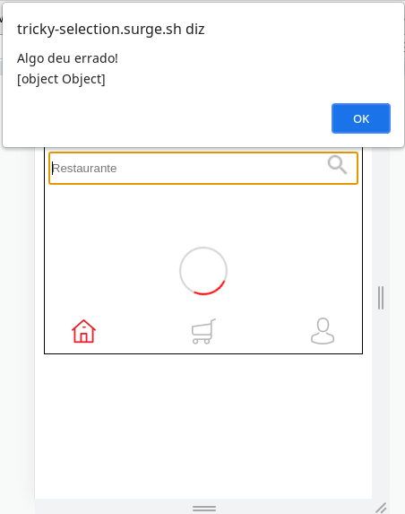
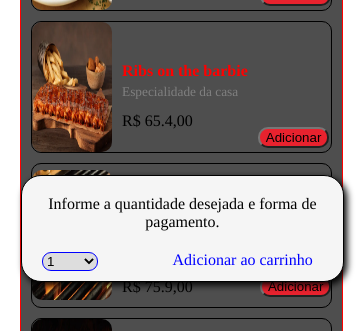
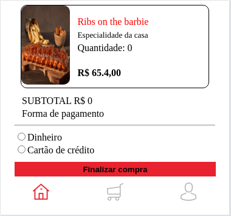

<body>
	
	<h3>Aplicativo web para serviços de restaurantes</h3>
	<ul>
		<li>
			Pagina inicial: Tela com o logo do aplicatio, o qual te redireciona para a tela de login ao ser 
			clicado.
		</li>
		<li>
			
Tela de login: 
			Atenção para um aparente bug.
			Após realizar o login com email e senha, um alert é mostrado com uma mensagem de erro:
			

			

			O Erro é provavelmente algum problema de identificação com a API, e é corrigido quando se redigita
			o endereço novamente. Enfatizando que não adianta recarregar a página, e sim, ir na barra de endereços
			e digitar novamente o link do surge. Dessa maneira você já é redirecionado para a página de feeds.

		</li>
		<li>
			Feeds: 
			Na pagina de feeds você tem uma lista com os restaurantes, o valor do
			frete e o tempo de entrega. No cabeçalho há uma caixa de texto para busca e logo abaixo
			um filtro com as categorias dos respectivos restaurantes. Clicando no outdoor de cada restaurantes
			você é direcionado para a pagina de detalhes. Onde poderá realizar seu pedido indicando
			o produto e quantidade. Isso é feito clicando no botão adicionar, quando será 
			aberta uma janela popup.
			

			 

			Aqui começam alguns erros. O valor que vem do input select não chega ao estado se não houver nenhum evento no input, ou seja, se o cliente simplesmente clicar no botão adicionar para abrir o popup e adicionar ao carrinho sem mexer no select, o valor da quantidade de produtos chegará como zero à API, o valor só é posto quando há eventos no input select(quando onChange no caso), ainda que o seu valor por padrão já seja o número 1 como se pode ver na imagem acima.
		</li>
		<li>

			Conclusão: 
			E a começar por esse pequeno detalhe a conclusão do projeto não pôde ser íntegra, pois a contabilidade nunca será coerente na hora de finalizar as compras,
			é um erro fatal. E além disso também encontrei muitas dificuldades para manipular os botões de rádio, o navegador até reconhece os valores quando alternados, mas não conwgui enviá-los ao estado do componente.

		</li>
	</ul>
